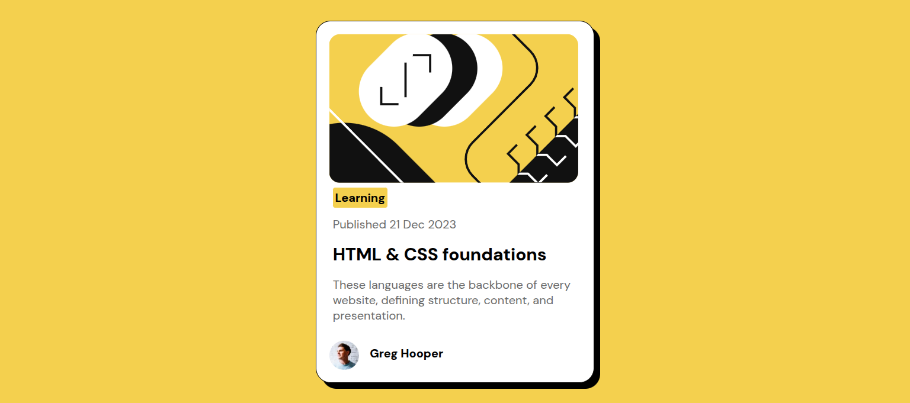

# Blog Card Component

A clean, modern blog card component created using HTML and CSS, with responsive design included.

## Project Scope

- Displays a blog article card.
- Contains an image, category label, publish date, title, description, and author info.
- Fully responsive for different screen sizes.

## Technologies Used

- HTML
- CSS

## Project Structure

```
project-folder/
├── index.html
├── style.css
├── images/
│   └── blog-image.png
```

## How to Run

1. Clone or download this repository.
2. Open `index.html` in your browser.


## 🔗 Live Demo  
[blog-preview-card-main](https://blog-preview-card-thayub.netlify.app/)
## Screenshot

Component preview:


